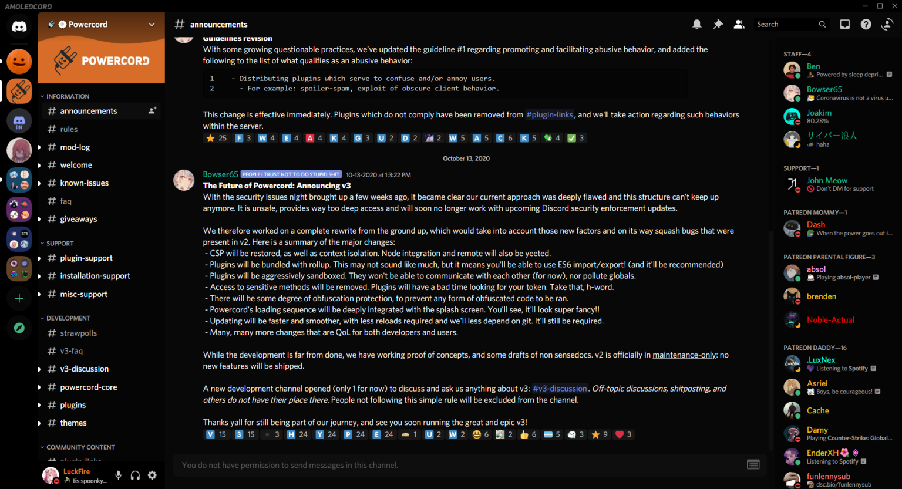

# AMOLED-Cord
A theme that's nice on your eyes, lights out baby. This is some-what based off of the AMOLED theme that's on Android, but it isn't as dark.

**This is my FIRST ever theme, don't expect everything to be done perfectly/flawlessly. Thing may be unthemed still, but most thing should be themed. If you find something that's unthemed/broke because of a Discord update, make an issue describing it or a pull request that fixes it at https://github.com/LuckFire/Theme-Source (since this is the source that changes the color for the theme). If you find something that doesn't relate to that, make an issue or pull request fixing it here.**



# Installation
Okay, let's get to the good stuff. If you'd like to install this AMAZING theme, go to **Themes -> Open CMD / Powershell / Terminal / Gitbash**, and enter the following:
```
git clone https://github.com/LuckFire/AMOLED-Cord
```

# More Previews


