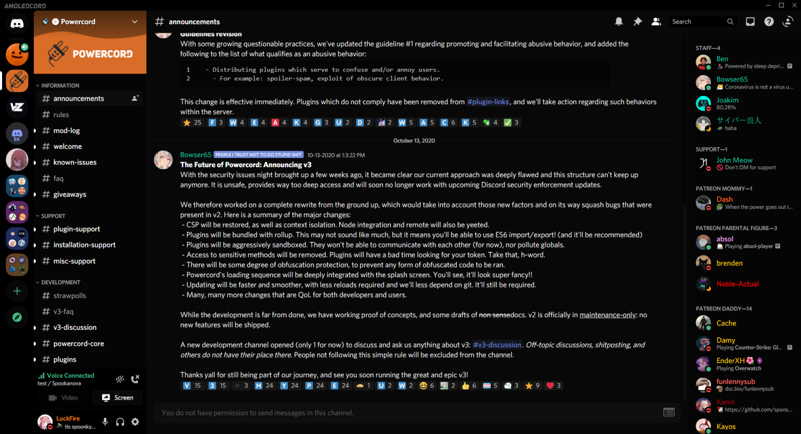
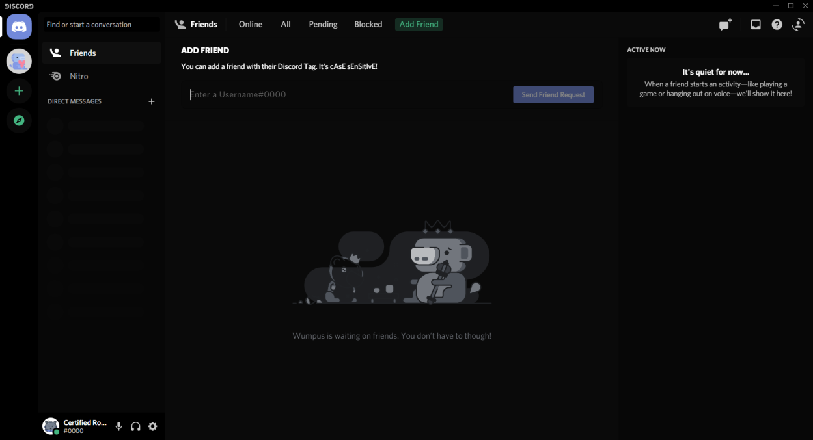
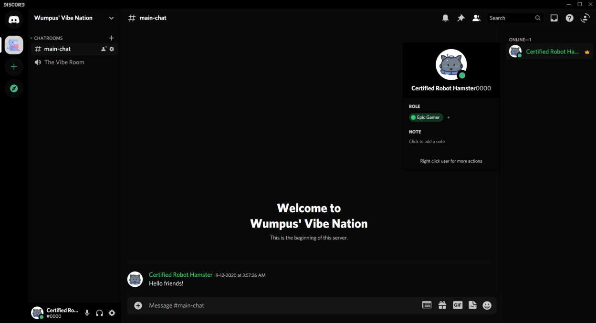
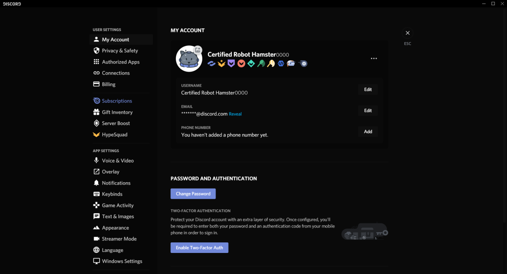

# AMOLED-Cord
A theme that's nice on your eyes, lights out baby. This is my first ever theme, don't expect *everything* to be perfect.

**This is my FIRST ever theme, don't expect everything to be perfect/flawless. Things may be unthemed still, but everything should be mostly themed. If you find something unthemed, make an issue or a pull request at https://github.com/LuckFire/Theme-Source (since that is the part of the source for the theme). If you find something that isn't colored properly, make an issue or pull request here.**



# Installation
Okay, let's get to the good stuff. If you'd like to install this AMAZING theme, go to **Themes -> Open CMD / Powershell / Terminal / Gitbash**, and enter the following:
```
git clone https://github.com/LuckFire/AMOLED-Cord
```

# More Previews



