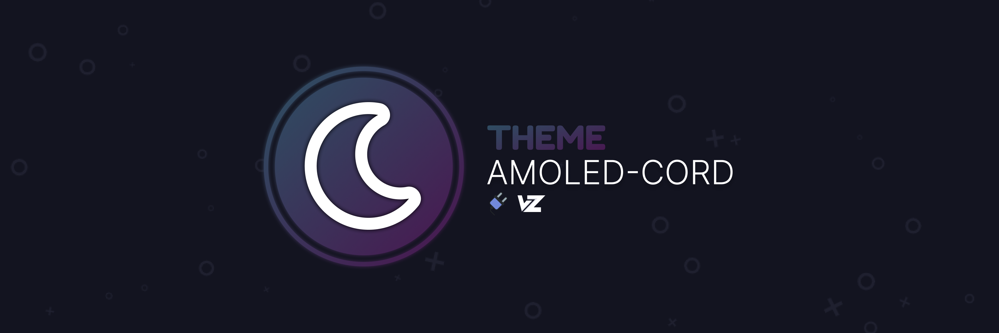
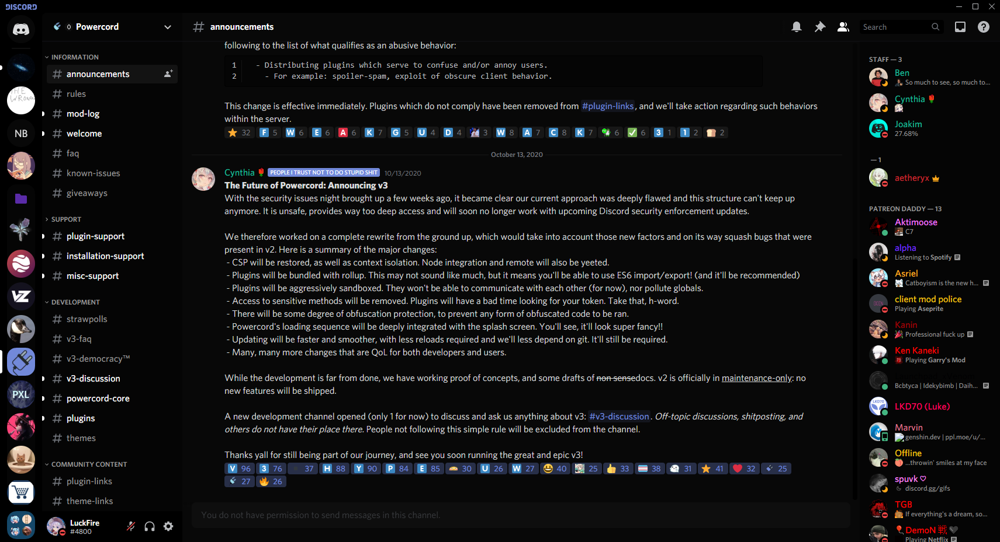

# AMOLED-Cord
A theme that's nice on your eyes.. lights out baby!
- This theme is (some-)what based off of the AMOLED theme that is on Android, but isn't as dark. This theme is obviously meant for Dark Mode only.



## Disclaimer:
This is my FIRST ever theme (redone as of Apr 11th, 2021), so don't expect everything to be done flawlessly. If you notice any issue with themeing, please report it to the [theme source](https://github.com/LuckFire/theme-source) repo, as this theme is based off using that.

## Installation
Alright, lets get to the good stuff! For Powercord & Vizality installation, go to **Themes -> Open CMD / Powershell / Terminal / Gitbash**, and enter the following:
```
git clone https://github.com/LuckFire/amoled-cord
```

**BetterDiscord installation will be coming soon!**

# Credits
A huge thank you to everyone who has helped.
- **[snapper](https://github.com/snappercord/)** for letting me use his Setting Icons & for making the light theme notification warning.
