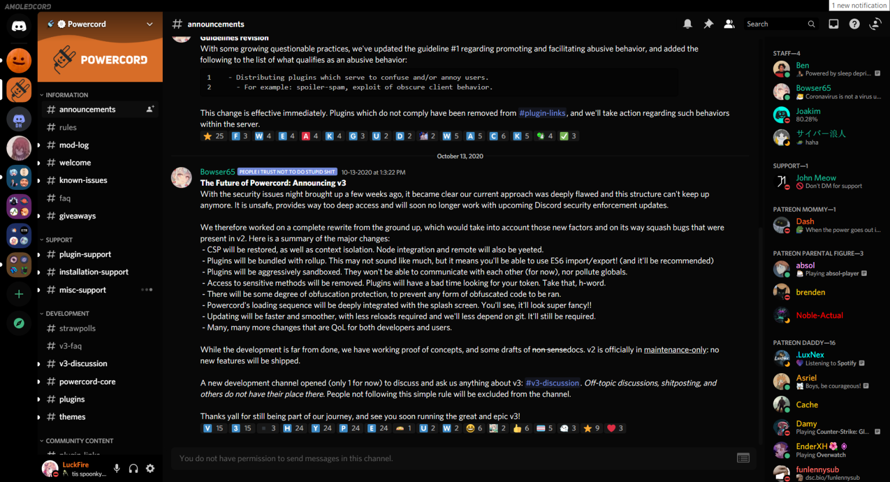
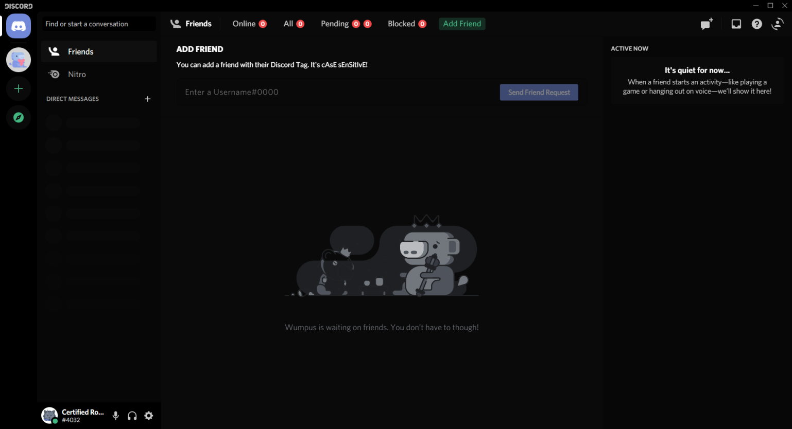

# AMOLED-Cord (in dev)
A theme that's nice on your eyes, lights out baby.



# Previews



# Installation
Okay, let's get to the good stuff. If you'd like to install this AMAZING theme, go to **Themes -> Open CMD / Powershell / Terminal / Gitbash**, and enter the following:
```
git clone https://github.com/LuckFire/AMOLED-Cord
```
